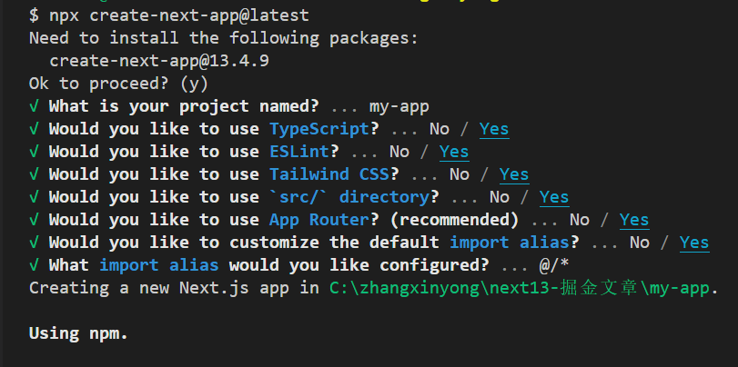
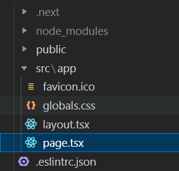
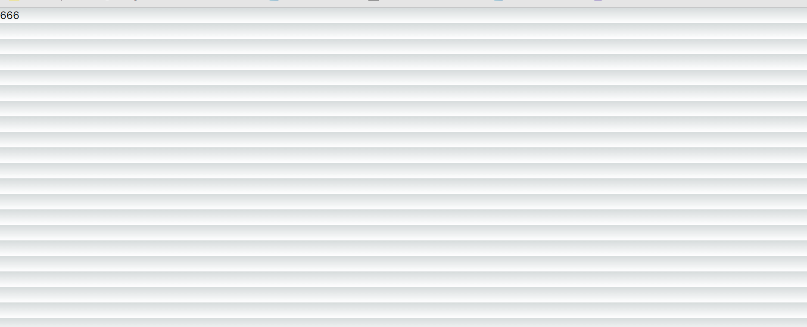
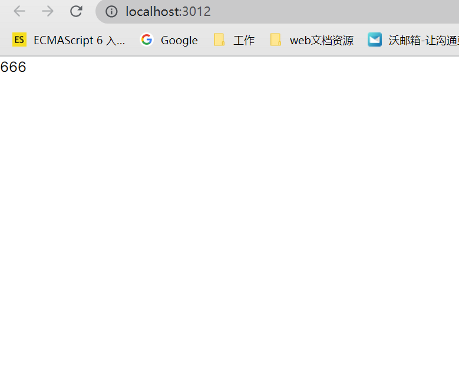
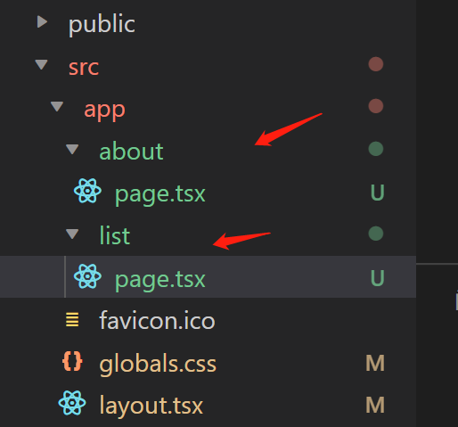
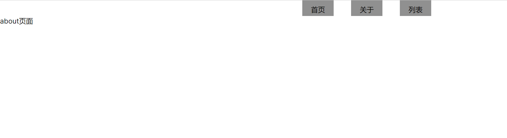

# 浅尝next13
[官网地址](https://nextjs.org/)   
不要看那个所谓的中文网站
## 创建项目
```
npx create-next-app@latest
```
下一步下一步就好了 如图所示

进到项目目录
```bash
npm run dev
```
打开浏览器访问 http://localhost:3000/ 就可以看到页面了
## 项目结构

- app目录 next13使用app目录，以前的pages目录也可以使用，但是不推荐使用了。默认使用app，我们接下来的例子都是使用app目录，注意他俩的api是不一样的。
- page.tsx 路由文件 可以认为是默认路由
- layout.tsx 布局文件 引入了globals.css 全局样式文件
## 路由
app目录下面的page.tsx就是路由文件  
我们尝试修改一个app/page.tsx文件
```tsx
export default function Home() {
  return <div>666</div>
}
```
然后刷新页面，就可以看到页面变成了666

样式太难看了，我们把globals.css里面的样式去掉 
修改一下启动端口
```json
 "scripts": {
    "dev": "next dev -p 3012",
    "build": "next build",
    "start": "next start",
    "lint": "next lint"
  },
```

接下来我们要做一个导航栏，点击导航栏可以跳转到其他页面，再首页还得送上接口数据，我们先来做导航栏
app/components/header
```tsx
import Link from "next/link"
import styles from "./index.module.scss"
export default function Hader() {
  return (
    <div className={`flex justify-center gap-10 ${styles.header} `}>
      <Link className="flex-4" href="/">
        首页
      </Link>
      <Link className="flex-4" href="/about">
        关于
      </Link>
      <Link className="flex-4" href="/list">
        列表
      </Link>
    </div>
  )
}
```
导航组件Link，最后渲染成a标签，href是跳转的地址。
/components/header/index.module.scss
```scss
.header {
  height: 36px;
  > a {
    background-color: #909090;
    padding: 10px 20px;
    display: block;

    height: 100%;
  }
}

```
next里面使用样式文件和react里面一样，看个人喜好，我这里
使用了tailwindcss和scss。
需要安装依赖
```bash
npm install sass sass-loader -D
```
添加ts类型文件
typings.d.ts
```ts
declare module '*.css';
declare module '*.scss';
declare module '*.sass';
declare module '*.svg';
declare module '*.png';
declare module '*.jpg';
declare module '*.jpeg';
declare module '*.gif';
declare module '*.bmp';
declare module '*.tiff';
declare module 'omit.js';

```
tsconfig.json 添加
```json
 "include": [
    ...
    "**/*.d.ts"
  ],
```

注意：如果你把组件放到app目录下并且是page.tsx默认就是路由  
layout.tsx
```tsx
import "./globals.css"
import type { Metadata } from "next"
import { Inter } from "next/font/google"
import Hader from "../components/header"
const inter = Inter({ subsets: ["latin"] })

export const metadata: Metadata = {
  title: "Create Next App",
  description: "Generated by create next app",
}

export default function RootLayout({
  children,
}: {
  children: React.ReactNode
}) {
  return (
    <html lang="en">
      <body className={inter.className}>
        <Hader></Hader>
        {children}
      </body>
    </html>
  )
}
```
我们再app目录下分别创建出来对应的页面，记住是 <strong>page.tsx</strong>


如图，导航没问题了，接下来我们要做的是接口数据。
## 接口数据 
next13 使用fetcher来获取数据，fetcher是一个函数，返回一个promise，我们先来看看、
假设现在有个接口地址 http://localhost:3000/api/list
